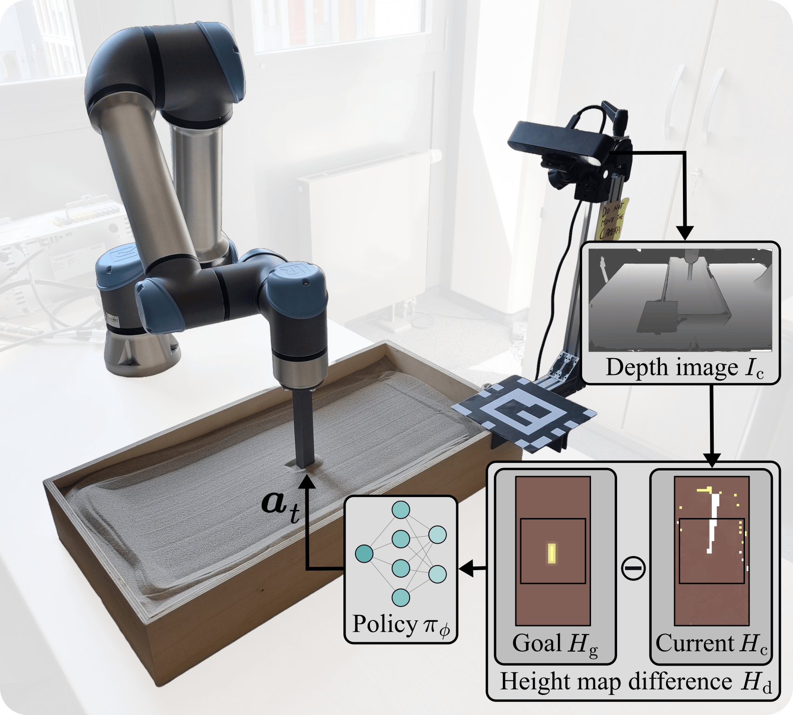

# Interactive Shaping of Granular Media Using Reinforcement Learning

<a href="https://humanoidsbonn.github.io/granular_rl/"></a>

This repository contains the accompanying code for the paper "Interactive Shaping of Granular Media with Reinforcement Learning" by B. Kreis, M. Mosbach, A. Ripke, M. E. Ullah, S. Behnke, M. Bennewitz accepted to the IEEE-RAS International Conference on Humanoid Robots (Humanoids).

## Code, Setup, and Usage
The code will be uploaded soon.

<a href="https://www.vecteezy.com/free-png/coming-soon"></a>

Image source: [vecteezy.com](https://www.vecteezy.com/free-png/coming-soon)

## Citation
Please cite our research as:
```
@inproceedings{kreis25humanoids,
  title={Interactive Shaping of Granular Media with Reinforcement Learning}, 
  author={B. Kreis, M. Mosbach, A. Ripke, M. E. Ullah, S. Behnke, M. Bennewitz},
  booktitle={Proc. of the IEEE-RAS Int. Conf. on Humanoid Robots (Humanoids)},
  year={2025}
}
```